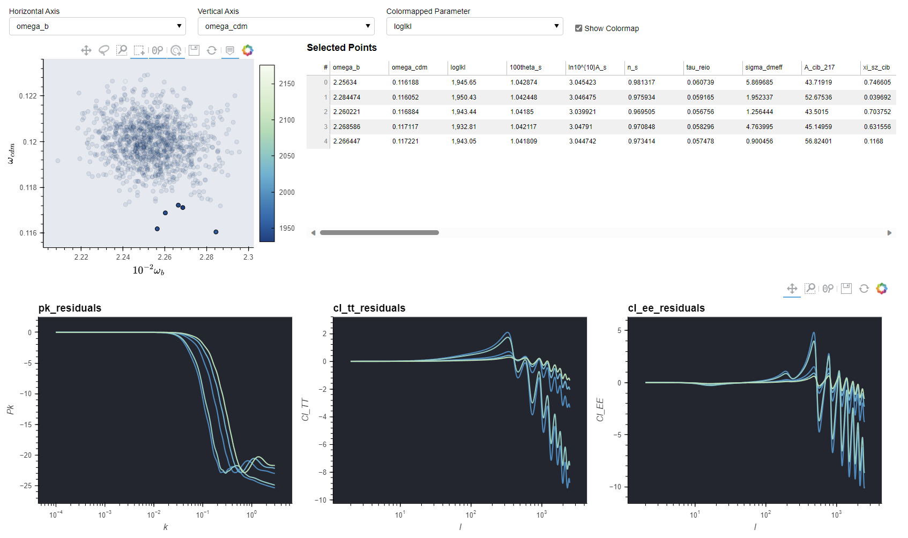

# InViz

InViz (Interactive Visualizer) is a tool for exploratory analysis of high-dimensional datasets where data points from the parameter space are used to calculate some set of real-world observables. This enables you to easily see how the derived observables change as you traverse the parameter space. If you have pre-computed observables, simply import them alongside the  dataset containing the parameters to start visualizing. Or, write your own function that takes your parameters as inputs, and give it to InViz to compute on the fly!

## Installation

### Dependencies
- Python versions $\geq$ 3.8 and $<$ 3.11 are supported.
- Holoviews $\leq$ 1.15.4 (this package and its dependencies will be installed automatically)

InViz can be installed with pip:

    python -m pip install inviz

Or, if you want to test the latest changes, you can clone the repository with
    
    git clone https://github.com/wen-jams/inviz
    cd inviz
    python setup.py install

## Getting Started

### Test Installation
To verify that inviz and all the dependencies have been installed correctly, open a Jupyter Notebook and run:
```python
import inviz as nv
```
If no errors appear, all the dependencies were installed correctly and we're ready to start visualizing!

### Example
Download and run the `live_data_example` notebook in the [tutorials](tutorials) folder to see an example of how inviz can be used.

Here's an example of InViz in an astrophysics context! The parameters come from a specific dark matter model, and the observables are the matter power spectrum and CMB anisotropy power spectra.


