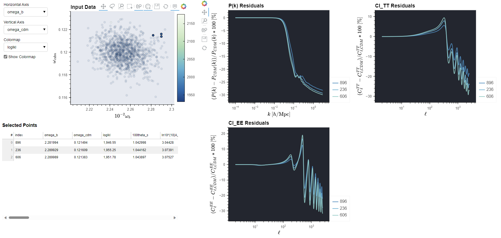

# BSAVI

BSAVI (Bayesian Sample Visualizer) is a tool to aid likelihood analysis of model parameters where samples from a distribution in the parameter space are used as inputs to calculate a given observable. For example, selecting a range of samples will allow you to easily see how the observables change as you traverse the sample distribution. At the core of BSAVI is the `Observable` object, which contains the data for a given observable and instructions for plotting it. It is modular, so you can write your own function that takes the parameter values as inputs, and BSAVI will use it to compute observables on the fly. It also accepts tabular data, so if you have pre-computed observables, simply import them alongside the dataset containing the sample distribution to start visualizing!

## Installation

### Dependencies

- Python versions $\geq$ 3.8 and $<$ 3.11 are supported.
- Holoviews $\geq$ 1.15.4 (this package and its dependencies will be installed automatically)
- Bokeh 2.4.3

BSAVI can be installed with pip:

    python -m pip install bsavi

Or, if you want to test the latest changes, you can clone the repository with

    git clone https://github.com/wen-jams/bsavi
    cd bsavi
    python setup.py install

## Getting Started

### Test Installation

To verify that bsavi and all the dependencies have been installed correctly, try running:

    import bsavi as bsv

If no errors appear, all the dependencies were installed correctly and we're ready to start visualizing!

### Example

Download and run the `live_data_example` notebook in the [tutorials](tutorials) folder to see an example of how bsavi can be used.

Here's BSAVI being used in an astrophysics context! The parameters come from a cosmological model of dark matter, and the observables are the matter and CMB power spectra.

## Contributing

Make feature requests and bug reports using the issue tracker: <https://github.com/wen-jams/bsavi/issues>

## License

MIT License

## Contact

<jimmywen74@gmail.com>
