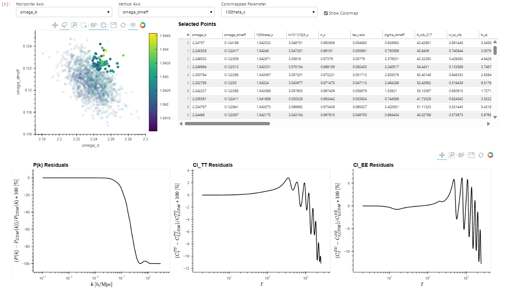

# inviz

This tool helps you explore the results of running MCMC posterior sampling on your cosmological model. Selecting a point on the sample distribution will automatically run CLASS on that sample and display the output. 

### Installation
Installation is straightforward with pip:

    python -m pip install inviz
Or, if you want to test the latest changes, you can clone the repository with
    
    git clone https://github.com/wen-jams/inviz
    cd inviz
    python setup.py install
### Dependencies
Currently, only Python versions $\geq$ 3.8 and $<$ 3.11 are supported.  You will also need the Cosmology Boltzmann code CLASS (either the default or your own modified version). Follow the instructions [here](https://cobaya.readthedocs.io/en/latest/theory_class.html) to install classy, the Python wrapper for CLASS.

## Getting Started

### Test Installation
To verify that inviz and all the dependencies have been installed correctly, open a Jupyter Notebook and run:
```python
from inviz import *
hv.extension('bokeh')
pn.extension()
```
If no errors appear, all the dependencies were installed correctly and we're ready to start visualizing!

### Example
Download and run the tutorial notebook in the [tutorials](tutorials) folder to see an example of how inviz can be used.

The result should look like this:
