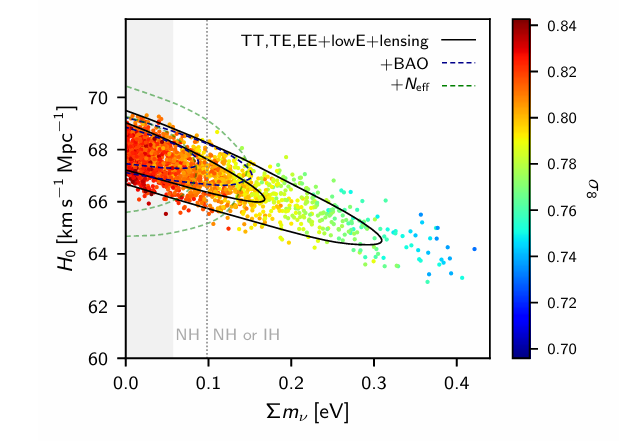
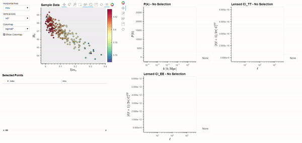

.. BSAVI documentation master file, created by
   sphinx-quickstart on Fri Sep 29 21:13:50 2023.
   You can adapt this file completely to your liking, but it should at least
   contain the root `toctree` directive.

Welcome to BSAVI's documentation!
=================================

BSAVI (Bayesian Sample Visualizer) is a tool to aid likelihood analysis of model parameters where samples 
from a distribution in the parameter space are used as inputs to calculate a given observable. 
For example, selecting a range of samples will allow you to easily see how the observables change 
as you traverse the sample distribution. At the core of BSAVI is the `Observable` object, which contains 
the data for a given observable and instructions for plotting it. It is modular, so you can write your 
own function that takes the parameter values as inputs, and BSAVI will use it to compute observables 
on the fly. It also accepts tabular data, so if you have pre-computed observables, simply import them 
alongside the dataset containing the sample distribution to start visualizing!

Check out the :doc:`usage` section for further information, including how to :ref:`install <installation>` the project. 
See :doc:`quickstart` for a brief introduction to the code. :doc:`class_examples` has examples for how cosmologists 
might use BSAVI, and for an in-depth walkthrough of BSAVI and all of its features, see :doc:`userguide`.

   Figure 34 from the `Planck 2018 Results <https://arxiv.org/abs/1807.06209>`_, showing the mnu-H0 slice of the parameter space.

      corresponding power spectra being shown.

   Exploring this exact parameter space using BSAVI.

.. .. video:: _static/bsavi-mainpage.mp4
..    :height: 300

.. note::

   This project is under active development.

Contents
--------
.. toctree::
   :maxdepth: 2

   usage
   quickstart
   class_examples
   userguide
   reference