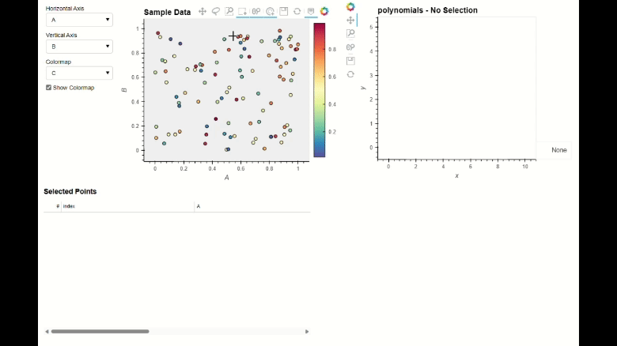

Quickstart
==========

Follow along for a basic example of how to use BSAVI. Works in a Jupyter Notebook or as a standalone Python script.
To see the full interactivity, download the "quickstart" notebook `here <https://github.com/wen-jams/bsavi/tree/main/tutorials>`_.

Imports:

.. code-block:: python

    import pandas as pd
    import numpy as np
    import bsavi as bsv

Set up some random data:

.. code-block:: python

    data = pd.DataFrame(np.random.rand(100, 4), columns=list('ABCD'))

Now take each row of ABCD values in our data and plug them into a polynomial function:

.. math::

    y(x) = Ax^B + Cx^D

.. code-block:: python

    xs = []
    ys = []
    for i in range(0,100):
        x = np.linspace(0, 10, 100)
        xs.append(x)
        y = data.at[i, 'A'] * x**data.at[i, 'B'] + data.at[i, 'C'] * x**data.at[i, 'D']
        ys.append(y)
    poly_df = pd.DataFrame({'x': xs, 'y': ys})

To visualize this, first construct an Observable object:

.. code-block:: python

    polynomials = bsv.Observable(
        name='polynomials', 
        parameters=[poly_df], 
        plot_type='Curve')

This contains the basic information required by BSAVI to visualize the function:

- Name: what to title the plot
- Parameters: the dataset containing the function values we just calculated
- Plot Type: what kind of plot to make (i.e. curve, scatter, etc.)

Then, call the Viz function:

.. code-block:: python

    bsv.viz(data, observables=[polynomials]).servable()

If running in a Jupyter Notebook, you should see a dashboard displayed inline.
If you'd rather see it in a separate browser window, run the cell below.

.. code-block:: python

    server = bsv.viz(data, observables=[polynomials]).show()

Once you are done with it, stop the server with:

.. code-block:: python

    server.stop()

If the above code is in a standalone Python file, say "my_app.py", run the below code
in the console:

.. code-block:: console

    $ panel serve path/to/my_app.py

Then click on the localhost link to view the dashboard in a separate browser tab.