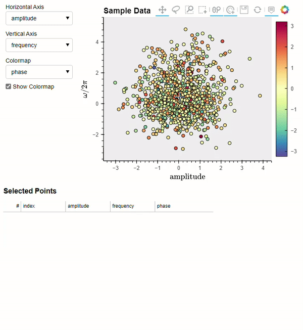
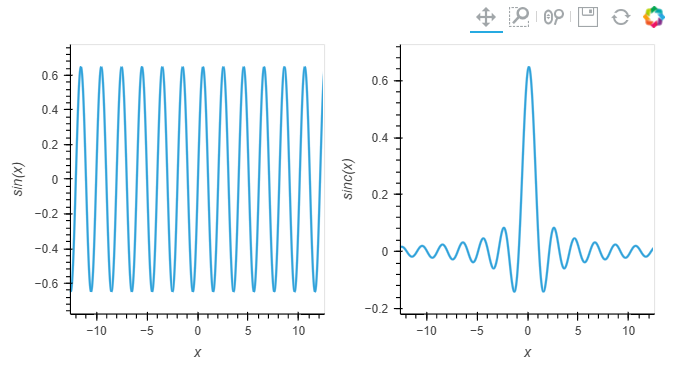
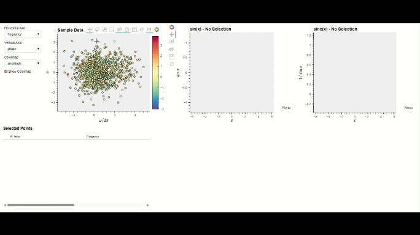

User Guide
==========

This guide will demonstrate and explain the features and functionality
of BSAVI by creating a visualization that will dynamically generate sine 
waves from frequency, phase, and amplitude data. It will follow the structure 
of the :doc:`class_examples` tutorials without requiring install of CLASS 
or any cosmologist-specific packages. A basic knowledge of plotting with
`HoloViews <https://holoviews.org/index.html>`__ is suggested, since it
is the utility that provides the interactive plots for this package.

Works in a Jupyter Notebook or as a standalone Python script.
To see the full interactivity, download the "userguide" notebook 
`here <https://github.com/wen-jams/bsavi/tree/main/tutorials>`_

.. code-block:: python

    # imports
    import bsavi as bsv
    import numpy as np
    import pandas as pd

Suppose we want to visualize how changes in amplitude, frequency, and
phase affect some wave functions. Let's choose the sine and sinc
functions.

A sine wave can be defined as:

.. math::

   y(x) = A \sin{(2\pi f x + \phi)} = A \sin{(\omega x + \phi)}

where :math:`A` is the amplitude, :math:`f` is the frequency,
:math:`\omega` is the angular frequency, and :math:`\phi` is the phase.

The sinc function is simply:

.. math::

   \mathrm{sinc}~(x) = \frac{\sin{(x)}}{x}

First let's generate some random data in three dimensions. These will be
samples of our amplitudes, frequencies and phases.

.. code-block:: python

    ndim, nsamples = 3, 1000
    
    np.random.seed(42)
    data1 = np.random.randn(ndim * 4 * nsamples // 5).reshape(
        [4 * nsamples // 5, ndim]
    )
    data2 = 4 * np.random.rand(ndim)[None, :] + np.random.randn(
        ndim * nsamples // 5
    ).reshape([nsamples // 5, ndim])
    data = np.vstack([data1, data2])

Then convert it into a pandas DataFrame (BSAVI only accepts DataFrames,
for now) and define column labels with some fancy :math:`\LaTeX`
formatting:

.. code-block:: python

    param_names = ['frequency', 'phase', 'amplitude']
    latex = ['\omega / 2\pi', '\phi', '\mathrm{amplitude}']
    df = pd.DataFrame(data, columns=param_names)
    latex_dict = dict(zip(param_names, latex))

.. code-block:: python

    df.head()

.. raw:: html

    

    
    <table border="1" class="dataframe">
      <thead>
        <tr style="text-align: right;">
          <th></th>
          <th>frequency</th>
          <th>phase</th>
          <th>amplitude</th>
        </tr>
      </thead>
      <tbody>
        <tr>
          <th>0</th>
          <td>0.496714</td>
          <td>-0.138264</td>
          <td>0.647689</td>
        </tr>
        <tr>
          <th>1</th>
          <td>1.523030</td>
          <td>-0.234153</td>
          <td>-0.234137</td>
        </tr>
        <tr>
          <th>2</th>
          <td>1.579213</td>
          <td>0.767435</td>
          <td>-0.469474</td>
        </tr>
        <tr>
          <th>3</th>
          <td>0.542560</td>
          <td>-0.463418</td>
          <td>-0.465730</td>
        </tr>
        <tr>
          <th>4</th>
          <td>0.241962</td>
          <td>-1.913280</td>
          <td>-1.724918</td>
        </tr>
      </tbody>
    </table>
    

We now have a table of samples which we can visualize directly with
``bsv.viz``. Bringing along the latex dict we made earlier:

.. code-block:: python

    bsv.viz(df, latex_dict=latex_dict)

Writing Functions for Observables
----------------------------------------

Next, we will define the function that takes a given row of samples from
the table above and uses it to compute the two waveforms.

Data Formats
~~~~~~~~~~~~

Any function that computes data for an Observable must return data in
the following format:

.. code:: python

   results = [
       {'x': np.array([x1, x2, ...]), 'y': np.array([y1, y2, ...])},
       {'z': np.array([z1, z2, ...]), 'w': np.array([w1, w2, ...])},
       ...
   ]

Examining this format more closely: we have a list of dictionaries that
contain two 1-D NumPy arrays, with their parameter names as the keys.
BSAVI will interpret each dict as its own observable and attempt to plot
it with the first array on the x axis and the second array on the y
axis. The keys will be used to label their respective axes.

This rather specific format is related to how HoloViews interfaces with
tabular datasets. `Their
documentation <https://holoviews.org/user_guide/Tabular_Datasets.html>`__
gives a full list of accepted data formats. While BSAVI currently only
supports the one detailed above, eventually all the pure Python, Numpy,
and Pandas data storage formats will be supported.

Another note: Observables and functions are one-to-one, so if you'd
rather have separate functions that all only return one set of data
points, but still want to visualize them together, you will have to
create an Observable for each. You are allowed to pass any amount of
arguments into each function though.

Most importantly, the function must have logic to select a sample from
an input dataset according to its index. This is because BSAVI will pass
the index corresponding to a point selected on the plot into your
function. Therefore, ``index`` is required as the first argument. Then
you can have an arbitrary amount of arguments. The example below is how
it should be done if the input dataset is a DataFrame.

.. code-block:: python

    def compute_waveforms(index, input_data):
        selection = input_data.iloc[[index]]
        x = np.linspace(-4*np.pi, 4*np.pi, 1000)
        angular_freq = 2*np.pi*selection['frequency'].iloc[0]
        phase = selection['phase'].iloc[0]
        amp = selection['amplitude'].iloc[0]
        sin = amp * np.sin(angular_freq*x + phase)
        sinc = amp * np.sinc(angular_freq*x/np.pi + phase)
        waves = [
            {'x': x, 'sin(x)': sin},
            {'x': x, 'sinc(x)': sinc},
        ]
        return waves

.. code-block:: python

    # example run
    sin, sinc = compute_waveforms(0, df)
    # plot them using holoviews
    import holoviews as hv
    layout = hv.Curve(sin, 'x', 'sin(x)') + hv.Curve(sinc, 'x', 'sinc(x)')
    layout

Creating an Observable
----------------------

Now we are ready to set up the Observable. This is a way to
associate your data with how it should be plotted, including title and
axis labels, LaTeX formatting, and other customizations. BSAVI
will use all this information when generating the visualizations. There 
are two types, Observable and LiveObservable, which deal with static data
and dynamic calculations, respectively. Below is the full list of options 
for both BSAVI Observable types:

:py:class:`bsavi.Observable`: the standard Observable, which takes tabular data 
to make plots.

- name: string or list of strings
    - specifies the display name of the observable for things like plot titles

- data: dict-like or list of dict-likes
    - the data to associated with that observable. can be python dict (or pandas DataFrame) 
        whose keys (or column names) will be used for things like plot axis labels. 

- plot_type: string
    - specifies how the data should be visualized. currently can pick 'Curve', 'Bars', or 'Scatter'

- plot_opts: holoviews Options object
    - customization options for the observable plot. see Holoviews documentation

- latex_labels: dict
    - dictionary of plain text parameter names as keys and latex versions as values for the data table
       
:py:class:`bsavi.LiveObservable`: an Observable that takes a function and uses it 
to calculate data for making plots. Has the same options as :py:class:`bsavi.Observable`,
but ``data`` is replaced with:

- myfunc: callable
    - a user-provided function that returns data. can return more than one set of data.

- myfunc_args: tuple
    - arguments for user-provided function

Note: BSAVI is limited to 2-D graphs (two plot axes), so there are three
*plot_types* available:

-  ``'Curve'``: A continuous line drawn through each point
-  ``'Scatter'``: A simple scatterplot of each point
-  ``'Bars'``: A series of bars with their heights determined by the
   y-axis value at each point

Customizations
~~~~~~~~~~~~~~

To apply customizations to your plots, use HoloViews Options
(documentation
`here <https://holoviews.org/user_guide/Applying_Customizations.html>`__).
They allow you to set axis limits, add logarithmic scaling to each axis,
and change the color cycles used for each plot element.

A brief summary of the most common options you might need:

-  *xlim, ylim*: tuple of the lower and upper axis range limits, to be
   used instead of auto axis scaling. Use ``None`` to denote no explicit
   upper/lower limit.

   -  For example: ylim=(None, 10) would cut the figure off for anything
      above 10, but the lower y value will be adjusted to fit the figure
      into the frame.

-  *logx, logy*: boolean values to set logarithmic scaling on either
   axis. Default is False.
-  *height, width*: integer values to set the size of the plot frame.
   BSAVI sets ``height=400, width=500`` by default.
-  *color*: sets the color of the plotted objects. This can be:

   -  a single color, e.g. ``'red'`` or
   -  a
      `cycle/palette <https://holoviews.org/user_guide/Style_Mapping.html#cycles-and-palettes>`__,
      which applies a colormap to an overlay and replaces the default
      colormap.

.. code-block:: python

    # setting up some customizations first
    import holoviews as hv
    from holoviews import opts
    opts1 = opts.Curve(xlim=(-4*np.pi, 4*np.pi), color=hv.Cycle('YlOrRd'), bgcolor='#151515')
    opts2 = opts.Scatter(xlim=(-4*np.pi, 4*np.pi), color=hv.Cycle('PuBuGn'), bgcolor='#151515')
    
    waves_latex = {
        'x': 'x', 
        'sin(x)': '\sin{x}',
        'sinc(x)': '1/\sin{x}',
    }

Pre-Computed Observables
~~~~~~~~~~~~~~~~~~~~~~~~

The function we wrote earlier, ``compute_waveforms``, is pretty fast.
But sometimes, we might have calculations that take several minutes or
longer to complete. Clicking on a point in the sample plot and waiting
minutes for a graph of your Observable to appear is not very fun. If we
compute our observable for every sample beforehand, it will make for a
more seamless interactive experience.

.. code-block:: python

    # go through the entire set of samples, computing waveforms for each set:
    waves_list = []
    for idx in range(0, len(df)):
        wave = compute_waveforms(idx, df)
        waves_list.append(wave)
    
    waves_df = pd.DataFrame(waves_list, columns=['sin(x)', 'sinc(x)'])

Now we can create an ``Observable``, giving it the wave data and specifying
plot titles, plot types, customizations, and latex labels.

.. code-block:: python

    waveforms = bsv.Observable(
        name=['sin(x)', 'sinc(x)'],
        data=computed_df,
        plot_type=['Curve', 'Scatter'],
        plot_opts=[opts1, opts2],
        latex_labels=waves_latex
    )

We can check that it works with 

.. code-block:: python

    waveforms.draw_plot([0])

Dynamically Computed Observables
~~~~~~~~~~~~~~~~~~~~~~~~~~~~~~~~

On the other hand, our function is fast enough that we can just have
BSAVI call it every time we select a sample. In this case, we will use 
``LiveObservable`` and give it our function, along with a tuple containing its
arguments. We can skip the first argument, ``index``, since it's
automatically handled by the visualizer.

.. code-block:: python

    dynamic_waveforms = bsv.LiveObservable(
        name=['sin(x)', 'sinc(x)'],
        myfunc=compute_waveforms,
        myfunc_args=(df,),
        plot_type='Curve',
        plot_opts=[opts1, opts2],
        latex_labels=waves_latex
    )

Again, check that it plots correctly with 

.. code-block:: python

    dynamic_waveforms.draw_plot([0])

Visualizing
-----------

Finally, we will use ``viz`` to interactively visualize the whole thing.
Here's an overview of the function arguments: - **data**: (Pandas
DataFrame) the data you want shown as a scatter plot - **observables**:
(list) a list of observables you'd like to visualize -
**show_observables**: (Boolean) whether you want to see the observable
plots or not (default = False if no observables, True if observables is
not None). - **latex_dict**: (dict) a dictionary containing the Latex
formatting for your axis labels (default = None)

Run the cell below to test out the interactivity by selecting points on
the scatterplot in the left section, and see what appears on the plots
in the right section!

.. code-block:: python

    bsv.viz(data=df, observables=[waveforms], latex_dict=latex_dict).servable()

If running in a Jupyter Notebook, you should see a dashboard displayed inline.
If you'd rather see it in a separate browser window, run the cell below.

.. code-block:: python

    server = bsv.viz(data=df, observables=[waveforms], latex_dict=latex_dict).show()

Once you are done with it, stop the server with:

.. code-block:: python

    server.stop()

Another option is to write all your code in a standalone script. Make sure you use 
``bsv.viz`` with the ``.servable()`` method, and that it is the last line of code in 
your script. Then serve it with:

.. code-block:: console

    $ panel serve path/to/my_app.py

Then click on the localhost link to view the dashboard in a separate browser tab.